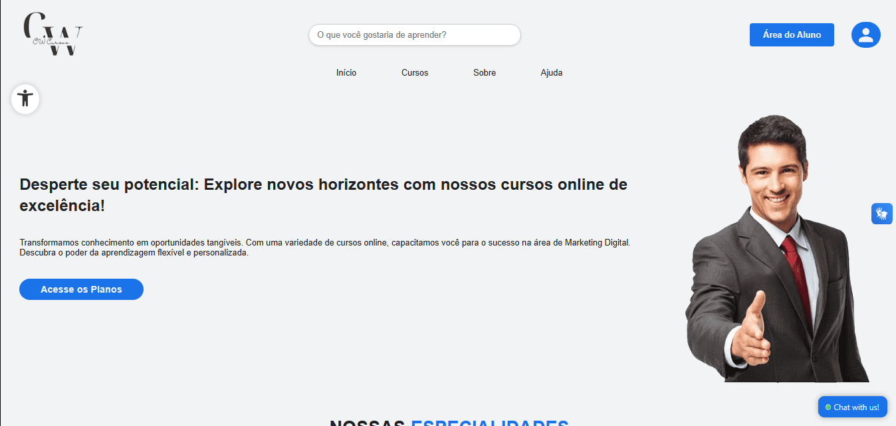
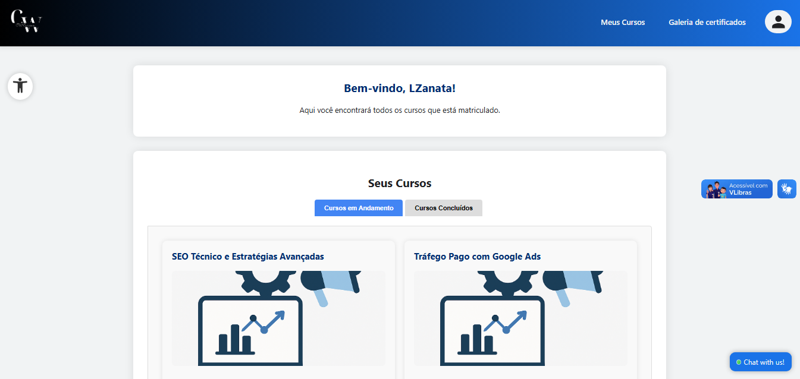
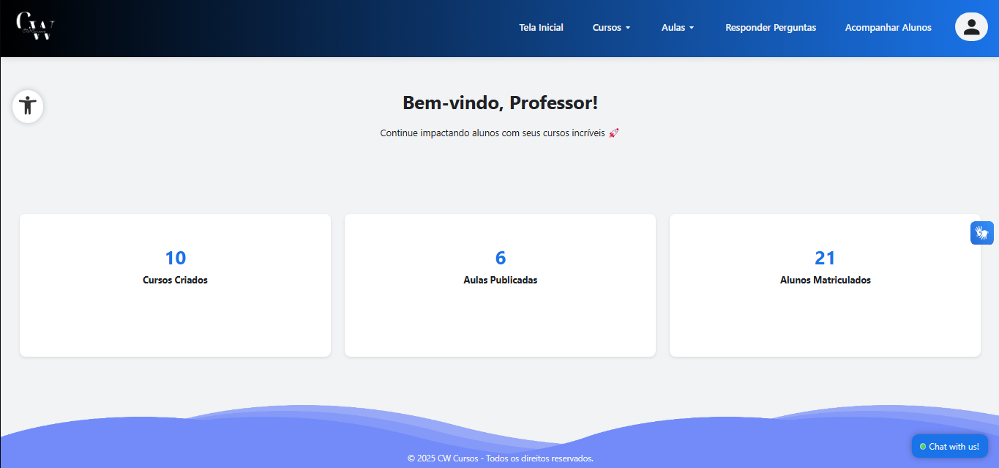
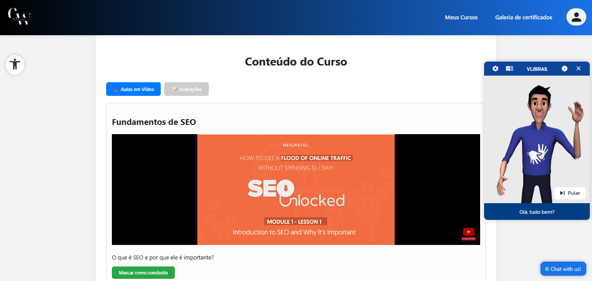
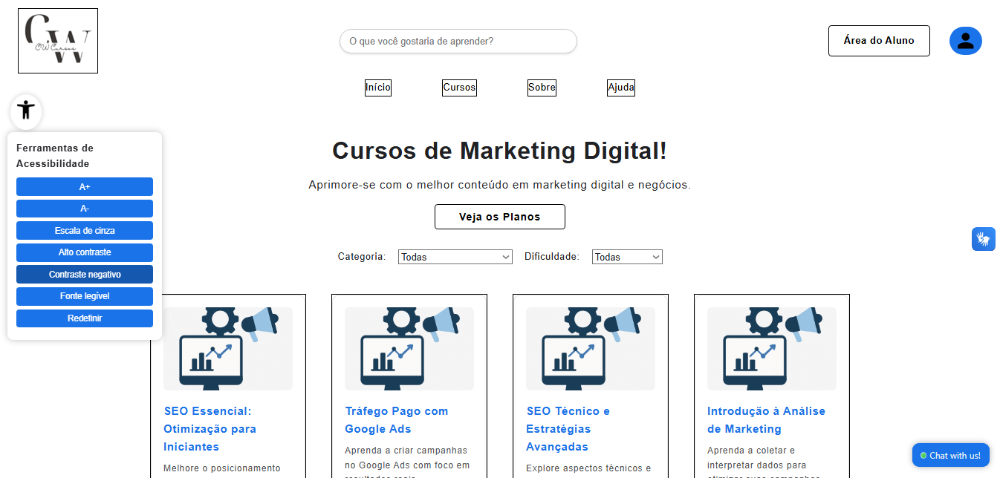
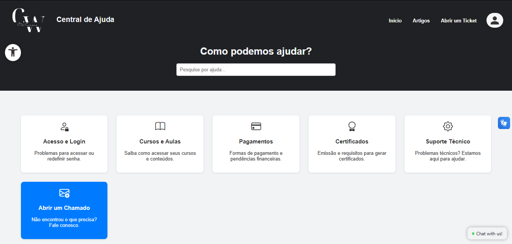

# CW Cursos

Plataforma de cursos online com foco em **acessibilidade** para pessoas com deficiência auditiva e visual.

## 🚀 Sobre o Projeto

A **CW Cursos** é uma plataforma de ensino digital que oferece cursos de marketing digital e outras áreas, com recursos pensados para inclusão e acessibilidade. O sistema foi desenvolvido em PHP, MySQL, HTML, CSS e JavaScript.

## 🌟 Funcionalidades Principais

- **Cadastro e Login de Usuários**
  - Aluno, Professor e Administrador
  - Ativação de conta por e-mail
  - Recuperação de senha

- **Área do Aluno**
  - Visualização de cursos matriculados
  - Progresso, avaliações e emissão de certificado
  - Feedback de cursos

- **Área do Professor**
  - Cadastro e gerenciamento de cursos
  - Upload de aulas em vídeo (YouTube)
  - Atividades, provas e acompanhamento de alunos

- **Painel do Administrador**
  - Gerenciamento de usuários, cursos e planos
  - Visualização de formulários de satisfação
  - Suporte e controle de tickets

- **Planos e Assinaturas**
  - Diferentes planos de acesso
  - Pagamento via cartão, PIX e PayPal

- **Suporte ao Usuário**
  - Central de ajuda com artigos e FAQ
  - Sistema de tickets de suporte

- **Acessibilidade**
  - Integração com [VLibras](https://www.vlibras.gov.br/) para tradução automática de textos para Libras
  - Estrutura compatível com leitores de tela
  - Legendas e transcrições recomendadas para vídeos
  - Painel de acessibilidade exclusivo para deficiêntes visuais

## 🖼️ Prints da Plataforma

### Tela Inicial


### Área do Aluno


### Área do Professor


### Suporte e VLibras


### Painel de Acessibilidade


### Central de Ajuda


## ♿ Diferenciais de Acessibilidade

- **VLibras**: Widget integrado em todas as páginas para tradução de textos em Libras.
- **Campos e botões acessíveis**: Uso de labels, contrastes e navegação facilitada.
- **Suporte a leitores de tela**: Estrutura semântica e uso de ARIA quando necessário.
- **Legendas e transcrições**: Incentivo ao uso de vídeos legendados e transcrições para conteúdos audiovisuais.

Além da integração com o [VLibras](https://www.vlibras.gov.br/), a plataforma **CW Cursos** conta com um **Painel de Acessibilidade** exclusivo, disponível em todas as páginas, oferecendo:

- **Ajuste de tamanho da fonte** (A+ / A-)
- **Escala de cinza**
- **Alto contraste**
- **Contraste negativo**
- **Fonte legível**
- **Redefinir preferências**

Essas opções permitem que pessoas com deficiência visual ou baixa visão personalizem a experiência conforme suas necessidades, tornando a navegação mais confortável e inclusiva.

## 🛠️ Tecnologias Utilizadas

- PHP 8+
- MySQL/MariaDB
- HTML5, CSS3, JavaScript
- Bootstrap Icons
- PHPMailer (envio de e-mails)
- VLibras (acessibilidade Libras)

## 📦 Estrutura do Projeto

```
/TelaInicial         # Páginas públicas e landing page
/aluno               # Área do aluno
/professor           # Área do professor
/administrador       # Painel administrativo
/suporte             # Central de ajuda e tickets
/cadastro_login      # Autenticação e cadastro
/funcoes             # Funções, uploads, configs, chatbot
/lib                 # Bibliotecas externas (PHPMailer, etc)
```

## ⚙️ Como rodar o projeto

1. Clone o repositório:
   ```bash
   git clone https://github.com/LZanata/CWCursos_Project.git
   ```
2. Configure o banco de dados em `/funcoes/conexao.php`.
3. Ajuste as constantes de caminho em `/funcoes/config.php` conforme seu ambiente.
4. Certifique-se de que as pastas de upload têm permissão de escrita.
5. Acesse `http://localhost:8080/CWCursos_Project/TelaInicial/index.php` no navegador.

## 📢 Contribuição

Sugestões, correções e melhorias são bem-vindas! Abra uma issue ou envie um pull request.

## 📄 Licença

Este projeto é de uso acadêmico e institucional. Para uso comercial, entre em contato.

---

**CW Cursos** – Educação acessível para todos!